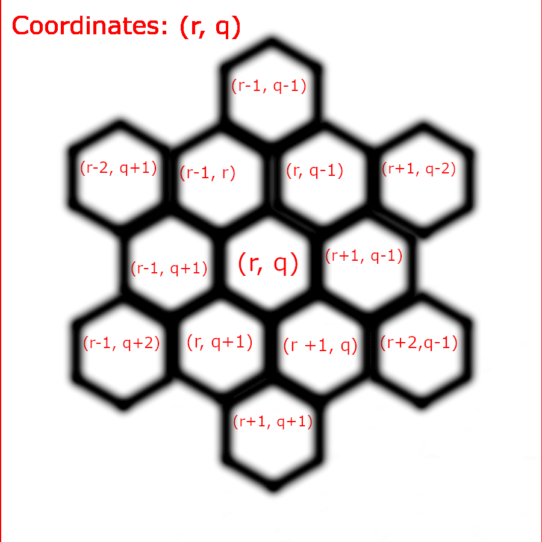
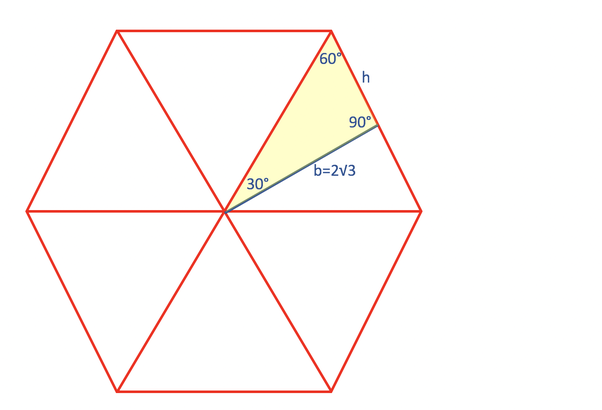

# EV3-Agrobotics

# Known Challenges
## Docking Station
### Objective
- The Docking Ring is a ring magnet. It will be located in the resource tray at the beginning of the match.
- The Docking Station Plate is a metal L bracket that will be mounted with wood screws on the 2”x4” table frame, centered with the DOCKING STATION. One side will be on top and the other will be on the inside of the game frame facing MISSION CONTROL.
### Description
- The robot must leave MISSION CONTROL, transport, and attach the Docking Ring to the DOCKING STATION Plate.
- Points are awarded when the Docking Ring is magnetically attached (not supported by the robot) to the DOCKING STATION Plate.
- This challenge is a prerequisite to all other challenges. No other challenges can be attempted until this one has been successfully completed.
- Once this challenge has been completed, the DOCKING STATION can be used as second PLAYER ZONE.
### Point Value
- 50 points for successfully completing the challenge

## Deliver Farming Module
### Objective
- The Farming Module is represented by a black atrium grate. It will be located in the resource tray at the beginning of the match
- It will be delivered to the Farming Module Zone pictured below.
### Description
- The robot must transport the Farming Module to the Farming Module Zone. The object must fit completely within the red and black-lined border of the zone
- Points will be awarded at the end of the match.
### Point Value
- 50 points for successfully completing the challenge.

## Deliver Containers to Modules
### Objective
- Modules will be represented by four (4) plastic hexagon shaped jars secured to the game mat using Dual Lock Velcro strips. Each jar will be placed on its side.
- The jars will be placed on green, red, yellow, and blue bordered hexagons printed on the mat. The mouth will face the same direction indicated by each arrow. Plastic jars will not have a lid on it.
- Seedling Containers are represented by yellow, green, blue and red 2-inch neoprene plant collars. Collars will be located in the Resource Tray at the beginning of the match. There will be 3 red, 3 yellow, 3 green, and 3 blue collars.
### Description
- Prerequisite: Objective 1 must have been successfully completed.
- The robot must deliver 3 of the matching-colored SEEDLING CONTAINERS on top of 4 different MODULES
- No more than 3 SEEDLING CONTAINERS can be placed on top of each MODULE. No points will be awarded for any extra SEEDLING CONTAINERS placed on top of the MODULES.
- Bonus points will be awarded if the 3 Seedling Containers are vertically stacked on top of the Module.
- Points will be awarded at the end of the match.
### Point Value
- 25 points for each container successfully placed. (300 points possible)
- Bonus of 50 points for each stack of 3. (200 points possible)

## Deliver Growing Medium to Growing Containers
### Objective
- Growing Containers will be represented by silicone baking cups.
- For Seniors, on the day of the contest Growing Containers will be randomly placed on the game mat within one of the many printed hexagons.
- This random placement for seniors will not change the day of the contest but will be different at the next competition. For example, State Fair will be different than Fort Worth. (Clarification added 10/11/22)
- Growing Medium will be represented by reusable Kcups (with lids closed).
### Description
- Prerequisite: Objective 1 must have been successfully completed.
- The robot must deliver Growing Medium into the Growing Containers. There is a maximum limit of 1 Growing Medium per Growing Container.
- To earn points, the Growing Container must remain within its original hexagon location throughout the match. If a team is not going for points for this challenge, the robot may move/retrieve this game piece. (Rule clarification added 10/11/22)
- The Growing Medium must rest completely inside the Growing Container in an upright, fully vertical position.
- Points will be awarded at the end of the match
### Point Value
- 100 points for each Growing Medium successfully delivered (400 points possible).
- 100-point bonus if all 4 containers are successfully delivered
- 500 points maximum

## Test Soil and Deliever Nutrients
### Objective
- This challenge will require the use of three 3-sided dice. During the match, one team member will roll 1 green, 1 red, and 1 blue die (only one roll per match) into the RESOURCE TRAY provided
- The number shown on the top of each die will determine the soil test results and indicate how many units of each nutrient will need to be delivered. Plastic jars (same as objective #3) will be placed on green, red, and blue bordered hexagons printed on the mat. The jar will not have a lid on it.
- Nutrients units will be represented by 1-inch, colored foam blocks.
- Green = Nitrogen (N) Red = Phosphorous (P) Blue = Potassium (K)
- Dice and a total of 9 blocks (3 blocks for each color) will be in the Resource Tray at the beginning of the match.
- As an example, all of the green blocks will be delivered to the module with the green border printed on the game mat.
### Description
- Prerequisite: Objective 1 must have been successfully completed.
- The robot must deliver the precise amount of Nutrients (N, P, and K) inside each corresponding, color coded Module. The amount is determined by the roll of the dice
### Point Value
- 150 points for the correct amount of nutrients successfully delivered to each module (450 points possible)
- 100-point bonus for placing all nutrients successfully delivered to all 3 modules.
- 550 points maximum

# The Approach
## Pathfinding
### General Approach to Pathfinding
First, the competition board is divided into small hexagons, to make pathfinding to specific coordinates more precise.

This is the general idea behind the program. Based off of the current position of the robot (using the coordinate system), a vector-based pathfinding system is implemented.

Initially, an automatic approach to pathfinding was used, however that proved to be inefficient at choosing paths when compared to a more manual approach. Thus, a hybrid pathfinding script was written, allowing our team to use custom written paths using the coordinate system as described above.

#### Getting Angles
To attain the necessary angles for the robot to pathfind to, the basic geometry of a hexagon was used. (see the image below for reference)

| Vector     | Angle |
|------------|-------|
| (r+1, q+1) | 0     |
| (r+1, q)   | 30    |
| (r+2, q-1) | 60    |
| (r+1, q-1) | 90    |
| (r+1, q-2) | 120   |
| (r, q-1)   | 150   |
| (r-1, q-1) | 180   |
| (r-1, q)   | 210   |
| (r-2, q+1) | 240   |
| (r-1, q+1) | 270   |
| (r-1, q+2) | 300   |
| (r, q+1)   | 330   |

### Getting to the Challenge
- The robot uses a hybrid pathfinding program. In other words, the coordinates of the tiles of the path must be given to the robot, but the program's algorithm decides the angle and distance to go.
## Completing the Challenge
- Once the hybrid pathfinding is complete, the robot executes a set of pre-defined instructions for the challenge.

# Useful links:
 - [Board layout](https://texas4-h.tamu.edu/wp-content/uploads/robotics_agrobotics_game_mat_2022_2023.pdf)
 - [ev3 Micropython documentation](https://pybricks.com/ev3-micropython/startbrick.html)
 - See the `reference` directory located in this repository for documents with further details outlining the competition